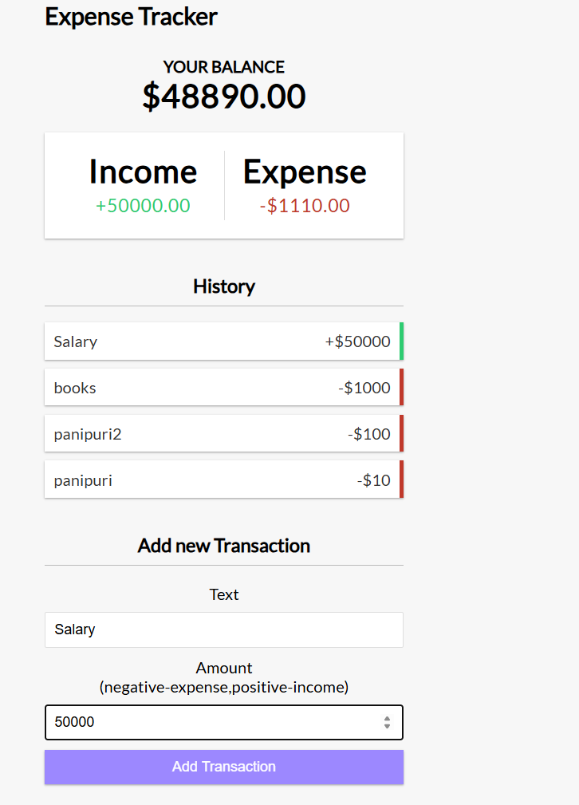

# 💸 Personal Expense Tracker

Track, visualize, and manage your daily expenses—built with React and Context API.


---

## 📸 Preview



---

## 🛠️ Tech Stack

- ⚛️ React
- 🧠 Context API
- 🎨 CSS
## 📂 Features

- 💰 Add, delete, and track expenses in real-time
- 📊 Dynamic balance and history updates
- 🧩 Modular components with functional architecture

---

## 🧪 How to Run Locally

```bash
git clone https://github.com/Sarfarazz24/personal_Expense_Tracker.git
cd personal_Expense_Tracker
npm install
npm start

